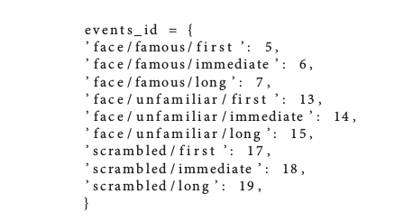

> 认知神经科学问题通常通过涉及一组受试者的实验来测试。该队列可以包括少数几个主题，用于在开放数据集中对数百或数千个受试者进行小规模研究。虽然存在各种各样的
> 在线资源开始分析脑磁图（MEG）或脑电图（EEG）数据，这类教育资料通常仅限于
> 对单个主题的分析。这部分是因为较大的小组研究的数据难以分享，但是对这些数据的分析通常需要特定主题的决策，这些决策很难记录。本文介绍了使用MNE软件包重新分析Wakeman and Henson（2015）的开放数据集所获得的结果。
> MNE分析操作包括了预处理步骤、质量保证步骤、诱发响应的传感器空间分析、源定位以及传感器和源空间中的统计。
> 在不同阶段提出并讨论了可能的替代策略的结果，例如使用高通滤波与基线校正，tSSS与SSS，使用最小范数逆(minimum norm inverse)与LCMV beamformer，以及使用单变量或多变量统计。这旨在提供对同一数据集上M / EEG分析管道的不同阶段的比较研究，可以开放访问并重现该分析所需的所有代码脚本。


### 1.序言

脑磁图和脑电图（M / EEG）是具有高时间分辨率的神经成像技术，它提供了对目前认为与认知相关的几乎任何时间尺度的人群级神经元动态的非侵入性访问。虽然MEG可以在更高的信噪比（SNR）下恢复空间模式，并且比EEG（Baillet，2017）具有更高的选择性皮质分辨率，但是EEG更便携且更便宜，因此支持在更广泛的情况进行认知研究。然而，由于数据的多维性质，脑相关的M / EEG信号的低SNR以及这些测量技术的灵敏度差异给处理M / EEG记录本身带来了挑战性。

我们将首先分析传感器空间中的数据。我们将讨论如何选择好的滤波器参数，标记不良数据段(marking bad data segments)，抑制伪迹(suppressing artifacts)， 移除伪迹(remove artifacts)，将数据打包到感兴趣的时间窗口(Epochs)，平均(averaging)和进行基线校正(baseline correction)。接下来，我们将注意力转向源定位(source localization)：从定义头部电导率模型(head conductivity model)，源空间(source space)，坐标框架配准(coregistration of coordinate frames)，数据白化(data whitening)，引线场计算(lead filed computation)，逆解算器(inverse solvers)以及源空间数据转换(transformation of source-space data to a common space)。在此过程中，我们将展示各种诊断可视化技术，以协助每个处理步骤的质量控制，例如通道功率谱密度（power spectral density ,PSD），具有空间颜色的蝴蝶图(butterfly plots)以便于阅读，地形图(topographic maps)和白化图(whitening plots)。最后，我们将尝试从我们的分析中提取指导原则，这些原则应有助于成功设计其他可重复的分析，而不是盲目地复制此处提供的技巧。

### 2. M/EEG处理流程

#### 2.1 读取数据

MNE支持M / EEG硬件供应商编写的多种文件格式。除了作为默认存储格式的Neuromag FIF文件外(后缀为fif)，MNE还可以原生读取多种其他格式，包括4D神经成像BTI，KIT和CTF，以及EEG数据B / EDF，EGI和EEGLAB set。尽管系统具有这种异构性，但MNE使用所谓的测量信息为记录的元数据提供了一致的接口。无论输入格式如何，所有处理过的文件都可以保存为FIF文件或HDF5格式。

MNE可以处理包含不同通道类型的多模态数据，最常见的是磁力计(magnetometer)，梯度计(gradiometer)，EEG，眼电图（EOG），心电图（ECG）和编码刺激范例的刺激触发通道。 MNE还支持肌电图（EMG），立体定向脑电图（sEEG）和脑电图（ECoG），功能性近红外光谱（fNIRS）或杂项（misc）通道类型。声明和重命名通道类型是分析前准备M / EEG数据集的常用步骤。在我们的例子中，一旦读入文件，需要重新命名一些通道并在测量信息中更正其通道类型：EEG061和EEG062电极设置为EOG，EEG063设置为作为ECG，EEG064被设置为杂项通道类型，因为它是自由浮动电极。如果省略该步骤，则一些预处理功能可能回退到可能不太理想的默认值，例如，在搜索心脏事件时使用磁力计的平均值而不是ECG通道。

##### 代码示例

**支持的数据类型的cheatsheet：**

| Datatype            | File format              | Extension | MNE-Python function                      |
| ------------------- | ------------------------ | --------- | ---------------------------------------- |
| MEG                 | Elekta Neuromag          | .fif      | [`mne.io.read_raw_fif()`](https://mne-tools.github.io/0.13/generated/mne.io.read_raw_fif.html#mne.io.read_raw_fif) |
| MEG                 | 4-D Neuroimaging / BTI   | dir       | [`mne.io.read_raw_bti()`](https://mne-tools.github.io/0.13/generated/mne.io.read_raw_bti.html#mne.io.read_raw_bti) |
| MEG                 | CTF                      | dir       | [`mne.io.read_raw_ctf()`](https://mne-tools.github.io/0.13/generated/mne.io.read_raw_ctf.html#mne.io.read_raw_ctf) |
| MEG                 | KIT                      | sqd       | [`mne.io.read_raw_kit()`](https://mne-tools.github.io/0.13/generated/mne.io.read_raw_kit.html#mne.io.read_raw_kit) and [`mne.read_epochs_kit()`](https://mne-tools.github.io/0.13/generated/mne.read_epochs_kit.html#mne.read_epochs_kit) |
| EEG                 | Brainvision              | .vhdr     | [`mne.io.read_raw_brainvision()`](https://mne-tools.github.io/0.13/generated/mne.io.read_raw_brainvision.html#mne.io.read_raw_brainvision) |
| EEG                 | Neuroscan CNT            | .cnt      | [`mne.io.read_raw_cnt()`](https://mne-tools.github.io/0.13/generated/mne.io.read_raw_cnt.html#mne.io.read_raw_cnt) |
| EEG                 | European data format     | .edf      | [`mne.io.read_raw_edf()`](https://mne-tools.github.io/0.13/generated/mne.io.read_raw_edf.html#mne.io.read_raw_edf) |
| EEG                 | Biosemi data format      | .bdf      | [`mne.io.read_raw_edf()`](https://mne-tools.github.io/0.13/generated/mne.io.read_raw_edf.html#mne.io.read_raw_edf) |
| EEG                 | EGI simple binary        | .egi      | [`mne.io.read_raw_egi()`](https://mne-tools.github.io/0.13/generated/mne.io.read_raw_egi.html#mne.io.read_raw_egi) |
| EEG                 | EEGLAB                   | .set      | [`mne.io.read_raw_eeglab()`](https://mne-tools.github.io/0.13/generated/mne.io.read_raw_eeglab.html#mne.io.read_raw_eeglab) and [`mne.read_epochs_eeglab()`](https://mne-tools.github.io/0.13/generated/mne.read_epochs_eeglab.html#mne.read_epochs_eeglab) |
| Electrode locations | elc, txt, csd, sfp, htps | Misc      | [`mne.channels.read_montage()`](https://mne-tools.github.io/0.13/generated/mne.channels.read_montage.html#mne.channels.read_montage) |
| Electrode locations | EEGLAB loc, locs, eloc   | Misc      | [`mne.channels.read_montage()`](https://mne-tools.github.io/0.13/generated/mne.channels.read_montage.html#mne.channels.read_montage) |


```python
from mne import io
raw_fname = '/MEG/sample/sample_audvis_filt-0-40_raw.fif'
raw = io.read_raw_fif(raw_fname)
# 或者
raw = io.read_raw_fif(raw_fname,preload=True)
```


#### 2.2 数据预处理

##### 2.2.1 麦克斯韦过滤器(Maxwell Filtering(SSS))

Neuromag MEG记录通常首先使用信号空间分离（SSS）方法进行预处理，也称为麦克斯韦过滤（Maxwell Filtering)。 SSS使用基于球谐函数的多极矩分解数据，并去除源自MEG头盔外部的磁场分量。因此，SSS可用于消除环境伪影，并且还可用于补偿记录期间的头部运动。

OpenfMRI（Poldrack和Gorgolewski，2017）提供的数据是已经使用专有的Elekta软件MaxFilter处理的文件，这是我们在分析中为了重现性而使用的。但是，MNE也提供了SSS的开源重新实现和扩展。在**运行SSS之前，标记坏信道至关重要，否则SSS可能会将伪迹从坏信道传播到数据中的所有其他MEG信道**。此步骤最好是通过目视检查手动完成。当使用MNE实现的麦克斯韦过滤时，我们重用了数据集中Elekta MaxFilter日志中可用的不良信道列表。图1中提供了比较原始数据，Elekta MaxFilter处理的数据和MNE maxwell_filter函数处理的数据的结果。虽然未处理的数据未显示明显的诱发响应，但麦克斯韦过滤数据确实显示了与事件相关的明确字段。在刺激后约100毫秒清除峰值。注意，由于组件正则化参数的计算略有不同，使用Elekta实现和MNE实现获得的结果具有最小差异。


原则上，SSS可以应用于使用任何MEG系统采集的数据，只要它具有全面的采样（超过约150个通道）。然而，到目前为止，除了306通道的Neuromag系统之外，还没有进行过广泛的测试。 SSS需要相对较高的校准精度，为此目的我们需要仔细校准Neuromag系统。如果SSS不是一种选择，例如由于缺乏精细校准信息，可以从信号空间预测（SSP）中轻松获得合理的降噪（Uusitalo和Ilmoniemi，1997）。这就相当于使用主成分分析（PCA）来预测空房间数据协方差矩阵的空间模式。实际上，根据房间的屏蔽，MEG供应商调整系统，以便生成的原始数据文件包含一些SSP向量，这些向量旨在用于消除环境噪声。这个SSP的数量可以在不同的安装之间变化，并且可以使用多达几十个矢量，尤其是磁力计。包含参考通道（例如，CTF）的系统中的另一种选择是使用所谓的“梯度补偿”来消除噪声。实际上，在这些系统中，SSS并不是抑制环境伪影的必要条件。然而，如果目标是计算总平均(grand average)，则仍然可以受益于基于SSS的运动补偿以将数据变换到公共坐标空间。

重要的是要强调，在SSS之后，磁强计和梯度计数据是从一个常见的低维SSS坐标系投影出来的，该坐标系通常跨越64到80维。结果，两种传感器类型都包含高度相似的信息，这也改变了信道间相关结构。这就是为什么MNE会在接下来的许多分析中将它们视为单一传感器类型的原因。


**代码示例**

- [Maxwell filtering to remove environmental noise](../Maxwell_filtering_to_remove_environmental_noise.ipynb)
- [Maxwell filter data with movement compensation](../Maxwell_filter_data_with_movement_compensation.ipynb)


##### 2.2.2 功率谱密度(Power Spectral Density(PSD))

所有可用数据信道的功率谱密度（PSD）估计提供了检查频谱伪像的便利方式，并且在某些情况下，检查了不良信道。 MNE使用标准的Welch方法计算原始数据的PSD（Welch，1967; Percival和Walden，1993），其中每个通道的信号在连续的时间段上进行分析，最终有一些重叠。对每个段进行加窗，然后计算离散傅里叶变换（DFT）系数的功率并对所有段进行平均。通过假设这些段中的每一个段提供静止过程的实现，平均过程产生具有降低噪声的PSD的无偏估计。

我们建议可视化通道方面的PSD图，而不是150个通道的平均值，因为这有助于发现异常通道。在图2中，我们在一次运行中显示一个受试者的EEG通道的PSD。我们使用长度为8192个样本的窗口（在1.1 kHz采样率下约为7.4 s），没有重叠。使用2的幂作为长度并且没有重叠加速计算。对PSD使用对数频率轴缩放可以通过便于筛选不良信道来实现质量控制。实际上，我们发现Wakeman和Henson（2015）的作者省略了一些可能不良的通道（例如，运行01的主题14中的EEG024），尽管它们在这样的图中清晰可见。具体地说，我们看到几个通道的低频功率强烈增加到1 Hz以下。另一方面，使用线性频率轴缩放，我们可以很容易地说服数据未经过滤，因为它包含来自50 Hz谐波的电源线的清晰峰值，以及五个头位置指示器（HPI）线圈用于监测受试者的头部位置，频率为293,307,314,321和328 Hz。

使用multitaper方法（Slepian，1978; Percival和Walden，1993）也可以实现同样的目的，其中数据通过正交数据逐渐变换成元素。然而，对于长连续记录，该方法可以比Welch方法慢一个数量级。对于短数据段，确实推荐使用multitaper方法。在这里，我们对用于原始连续数据的诊断目的的PSD感兴趣，因此我们使用Welch方法，a.k.a。平均周期图方法。

**示例**

- [Compute power spectrum densities of the sources with dSPM](../Compute_power_spectrum_densities_of_the_sources_with_dSPM.ipynb)
- [Compute the power spectral density of raw data](../Compute_the_power_spectral_density_of_raw_data.ipynb)

##### 2.2.3 时间滤波(Temporal Filtering)

在这项研究中，我们专注于40 Hz以下的事件相关脑信号。我们使用窗口设计方法（SciPy 5中的“firwin”; Hamming窗口）使用零相位有限脉冲响应（FIR）滤波器，使用363的滤波器长度实现40 Hz转角频率和10 Hz转换带宽的低通样品（0.330秒）。这种滤波器不会影响感兴趣的ERP信号，衰减50 Hz的线路频率和所有HPI线圈频率。由于宽的过渡带，它还限制了时间振铃的影响。由于低通足够低，我们没有单独使用陷波滤波器。请注意，对于与事件相关的大脑反应的所有研究，这种过滤器的选择不一定是一个很好的默认值，因为ERF或ERP可以包含相当高的频率（参见例如Götz等，2015）。

滤波时，重要的是要考虑滤波器的频率响应和脉冲响应。使用的默认滤波器根据截止频率调整滤波器长度和过渡带大小，如EEGLAB软件中所做的那样（Parks and Burrus，1987; Ifeachor和Jervis，2002; Widmann等，2015）6虽然没有默认参数满足所有分析要求，MNE选择旨在实现合理的阻带衰减的参数，而无需过多的滤波器振铃。为了说明这一点，我们使用图3中的频率响应和脉冲响应图来比较跨MNE版本的滤波器。图3A，B中的阻带衰减和转换带宽在较新版本中的限制较少，这导致较小的陡峭衰减但脉冲响应中的时间振铃也较少（见图3C，D）。可以看出，先前的默认参数引起了更强的滤波伪像，如通过时间窗口的更高脉冲响应幅度所指示的。

如果信号质量令人满意，则可能不需要过滤。在这项研究的背景下，我们决定基线纠正我们的信号，而不是高通过滤它们，记住社区正在讨论的这个主题（Acunzo等，2012; Rousselet，2012; Widmann和Schröger， 2012; Tanner等，2015; Maess等，2016）。我们的选择将在第3.7节关于基线校正的动机中得到推动。请注意，由于过滤导致的群组延迟会导致ERP延迟的变化。在线性相位FIR滤波器的情况下，这可以得到补偿。但是，在具有非线性相位的IIR滤波器的情况下，这是不可能的。然而，这可以通过使用所谓的前向 - 后向滤波来减轻，所述前向后向滤波涉及使用相同的滤波器两次：首先，使用原始信号，然后使用相反的信号版本。另一种选择是使用峰值保留滤波器，例如Savitzky Golay滤波器。无论使用何种补偿程序，它仍然可以影响时间解码结果的延迟，如Ramkumar等人所述。 （2013年）。在这种情况下，可能优选使用具有较短脉冲响应的滤波器或对未滤波的数据执行解码。

##### 2.2.4 标记坏通道/分段(Marking Bad Segments and Channels)

管道中的下一步是删除不良数据段和坏通道。由于数据已经使用Maxwell滤波器处理，因此在此阶段没有更糟糕的MEG通道。对于糟糕的脑电图频道，我们使用原作者提供的频道。为了消除由于瞬态伪像导致的不良数据段和不良时期，MNE可以交互地使用epochs绘图仪，或者通过脚本来完成。无论哪种方式，从进一步分析中删除的所有历元的索引都记录在epochs对象的drop log属性中（参见Epochs类7的在线文档）。

在我们构建可重现的管道时，我们更喜欢脚本路由。在MNE中，这可以通过去除峰 - 峰幅度超过某个拒绝阈值的试验来实现。尽管这对单一主题分析的效果相当好，但可能需要针对小组研究中的个别主题进行调整。因此，我们不是手动指定阈值，而是使用autoreject（global）（Jas et al。，2017）算法从数据中学习。自动注入是一种无监督算法，它最小化交叉验证误差，通过训练集的平均信号和验证集的中值信号之间的Frobenius范数来测量。自动注入不仅可以删除在隔离的MEG或EEG通道中包含瞬态跳跃的试验，还可以消除影响正面区域中通道组的眨眼伪影。由于我们正在处理视觉刺激，因此优选在刺激呈现间隔上使用EOG拒绝阈值完全去除眨眼试验，而不是使用诸如ICA或SSP的空间滤波器来抑制伪像。鉴于我们可以使用的大量试验，我们可以在不影响结果的情况下删除一些试验。为了进行组平均，通过球形样条插值（Perrin等，1989）修复坏的EEG通道，以便为每个受试者提供相同的通道组。

**将MEG 2443 标记为坏通道：**

```python
raw.info['bads'] = ['MEG2443']  
```


**channel或者time的分割**

- [Time Segment](../Time_segment.ipynb)
- [Channels Segment](../Channels_segment.ipynb)


##### 2.2.5 独立成分分析(Independent Component Analysis (ICA))

##### 2.2.6 Epoching

在事件相关的M / EEG研究中，触发通道（在该数据STI101中）包含二进制编码的触发脉冲以标记事件的开始/偏移。可以在分析期间从数据中自动提取这些脉冲，并将触发通道上的值映射到事件ID。当触发通道中的信号增加，减少或两者都增加时，MNE提供了提取事件的可能性。它还允许构造二进制掩码以便于仅选择期望的事件。当提取事件时，我们屏蔽了触发通道中的高阶位，因为这些事件对应于按键。在提取之后，用户可以根据需要自由地操纵或创建事件，因为它们仅需要（i）样本号，以及（ii）与实验或分析相关的一些整数代码。

作为下一步，我们从围绕这些事件的连续记录中提取数据段，并将它们存储为MNE中的单个试验，也称为时期。 Epochs对象可以存储多个事件的数据，用户可以选择这些事件的子集作为epochs [event_id] 8。此外，MNE为用户提供了通过使用标签来定义事件层次结构的可能性（类似于Bigdely-Shamlo等人，2013年的分层事件描述符）。这是使用event_id完成的，event_id是键值对的字典，键是由正斜杠（/）分隔的标签，值是触发器代码9。对于本研究中使用的范例，我们使用了：




层次结构的最高层是“面子”和“混乱”。“面孔”可以是“着名的”或“陌生的”。而着名的面孔可以是“第一”，“立即”或“长”（这种区别）在我们的分析中没有使用三类着名的面孔之间）。稍后，访问与“面部”条件相关的所有时期是直截了当的，因为只需要使用时期['face']并且MNE内部将所有子条件汇集在一起。最后，在刺激开始前200ms开始并且在下一个刺激开始的最早可能时间之后2900ms结束时构建时期。

##### 2.2.7 基线校正(Baseline Correction)

通常的做法是使用基线校正，以便消除基线中的任何恒定偏移。通过消除数据中的低频分量，高通滤波实现了类似的结果。但是，当使用基线校正时，数据中存在的低频漂移不会衰减。因此，如果可能的话，检查数据的长时间过程以确定是否存在低频漂移是有用的。两种方法之间的差异可以在图4中看到。图中的诱发反应是着名的面部条件的跨平均值。如果使用大约一秒的最大时间，则简单的基线校正似乎在后面的响应中产生不希望的“扇形”。实际上，在图4A中可以观察到在刺激后的一秒钟，通道仍然显着偏离但是，通过延长时间窗口（这里为2.9秒），我们可以看到信号主要返回到基线水平。

对于1 Hz（和1 Hz过渡带）的高通滤波器，信号会更快地返回基线电平。还要注意图4B，C之间的相似性，说明如何使用SSS算法的时间版本（tSSS）隐式地作为高通滤波器。对于tSSS，我们使用长度为1 s的缓冲区大小和0.95的相关限制来拒绝重叠的内/外信号。然而，这些高通过效应的代价是扭曲了持续的反应。因此，我们将重点关注利用基线校正数据的分析。


### 3. 传感器空间分析( Sensor Space Analysis)


### 4. Source Reconstruction


### 5. 总结


### 参考

- <A Reproducible MEG/EEG Group Study With the MNE Software: Recommendations, Quality Assessments, and Good Practices>
- [MNE Manual 0.13](https://mne-tools.github.io/0.13/manual/index.html)
- [MNE: The typical M/EEG workflow](https://mne-tools.github.io/0.16/manual/cookbook.html)