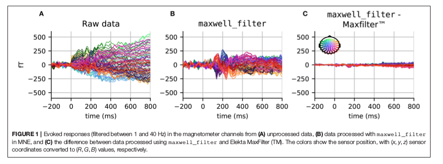

> 认知神经科学问题通常通过涉及一组受试者的实验来测试。该队列可以包括少数几个主题，用于在开放数据集中对数百或数千个受试者进行小规模研究。虽然存在各种各样的
> 在线资源开始分析脑磁图（MEG）或脑电图（EEG）数据，这类教育资料通常仅限于
> 对单个主题的分析。这部分是因为较大的小组研究的数据难以分享，但是对这些数据的分析通常需要特定主题的决策，这些决策很难记录。本文介绍了使用MNE软件包重新分析Wakeman and Henson（2015）的开放数据集所获得的结果。
> MNE分析操作包括了预处理步骤、质量保证步骤、诱发响应的传感器空间分析、源定位以及传感器和源空间中的统计。
> 在不同阶段提出并讨论了可能的替代策略的结果，例如使用高通滤波与基线校正，tSSS与SSS，使用最小范数逆(minimum norm inverse)与LCMV beamformer，以及使用单变量或多变量统计。这旨在提供对同一数据集上M / EEG分析管道的不同阶段的比较研究，可以开放访问并重现该分析所需的所有代码脚本。


### 1.序言

脑磁图和脑电图（M / EEG）是具有高时间分辨率的神经成像技术，它提供了对目前认为与认知相关的几乎任何时间尺度的人群级神经元动态的非侵入性访问。虽然MEG可以在更高的信噪比（SNR）下恢复空间模式，并且比EEG（Baillet，2017）具有更高的选择性皮质分辨率，但是EEG更便携且更便宜，因此支持在更广泛的情况进行认知研究。然而，由于数据的多维性质，脑相关的M / EEG信号的低SNR以及这些测量技术的灵敏度差异给处理M / EEG记录本身带来了挑战性。

我们将首先分析传感器空间中的数据。我们将讨论如何选择好的滤波器参数，标记不良数据段(marking bad data segments)，抑制伪迹(suppressing artifacts)， 移除伪迹(remove artifacts)，将数据打包到感兴趣的时间窗口(Epochs)，平均(averaging)和进行基线校正(baseline correction)。接下来，我们将注意力转向源定位(source localization)：从定义头部电导率模型(head conductivity model)，源空间(source space)，坐标框架配准(coregistration of coordinate frames)，数据白化(data whitening)，引线场计算(lead filed computation)，逆解算器(inverse solvers)以及源空间数据转换(transformation of source-space data to a common space)。在此过程中，我们将展示各种诊断可视化技术，以协助每个处理步骤的质量控制，例如通道功率谱密度（power spectral density ,PSD），具有空间颜色的蝴蝶图(butterfly plots)以便于阅读，地形图(topographic maps)和白化图(whitening plots)。最后，我们将尝试从我们的分析中提取指导原则，这些原则应有助于成功设计其他可重复的分析，而不是盲目地复制此处提供的技巧。

### 2. M/EEG处理流程

#### 2.1 读取数据

MNE支持M / EEG硬件供应商编写的多种文件格式。除了作为默认存储格式的Neuromag FIF文件外(后缀为fif)，MNE还可以原生读取多种其他格式，包括4D神经成像BTI，KIT和CTF，以及EEG数据B / EDF，EGI和EEGLAB set。尽管系统具有这种异构性，但MNE使用所谓的测量信息为记录的元数据提供了一致的接口。无论输入格式如何，所有处理过的文件都可以保存为FIF文件或HDF5格式。

MNE可以处理包含不同通道类型的多模态数据，最常见的是磁力计(magnetometer)，梯度计(gradiometer)，EEG，眼电图（EOG），心电图（ECG）和编码刺激范例的刺激触发通道。 MNE还支持肌电图（EMG），立体定向脑电图（sEEG）和脑电图（ECoG），功能性近红外光谱（fNIRS）或杂项（misc）通道类型。声明和重命名通道类型是分析前准备M / EEG数据集的常用步骤。在我们的例子中，一旦读入文件，需要重新命名一些通道并在测量信息中更正其通道类型：EEG061和EEG062电极设置为EOG，EEG063设置为作为ECG，EEG064被设置为杂项通道类型，因为它是自由浮动电极。如果省略该步骤，则一些预处理功能可能回退到可能不太理想的默认值，例如，在搜索心脏事件时使用磁力计的平均值而不是ECG通道。

##### 代码示例

**支持的数据类型的cheatsheet：**

| Datatype            | File format              | Extension | MNE-Python function                      |
| ------------------- | ------------------------ | --------- | ---------------------------------------- |
| MEG                 | Elekta Neuromag          | .fif      | [`mne.io.read_raw_fif()`](https://mne-tools.github.io/0.13/generated/mne.io.read_raw_fif.html#mne.io.read_raw_fif) |
| MEG                 | 4-D Neuroimaging / BTI   | dir       | [`mne.io.read_raw_bti()`](https://mne-tools.github.io/0.13/generated/mne.io.read_raw_bti.html#mne.io.read_raw_bti) |
| MEG                 | CTF                      | dir       | [`mne.io.read_raw_ctf()`](https://mne-tools.github.io/0.13/generated/mne.io.read_raw_ctf.html#mne.io.read_raw_ctf) |
| MEG                 | KIT                      | sqd       | [`mne.io.read_raw_kit()`](https://mne-tools.github.io/0.13/generated/mne.io.read_raw_kit.html#mne.io.read_raw_kit) and [`mne.read_epochs_kit()`](https://mne-tools.github.io/0.13/generated/mne.read_epochs_kit.html#mne.read_epochs_kit) |
| EEG                 | Brainvision              | .vhdr     | [`mne.io.read_raw_brainvision()`](https://mne-tools.github.io/0.13/generated/mne.io.read_raw_brainvision.html#mne.io.read_raw_brainvision) |
| EEG                 | Neuroscan CNT            | .cnt      | [`mne.io.read_raw_cnt()`](https://mne-tools.github.io/0.13/generated/mne.io.read_raw_cnt.html#mne.io.read_raw_cnt) |
| EEG                 | European data format     | .edf      | [`mne.io.read_raw_edf()`](https://mne-tools.github.io/0.13/generated/mne.io.read_raw_edf.html#mne.io.read_raw_edf) |
| EEG                 | Biosemi data format      | .bdf      | [`mne.io.read_raw_edf()`](https://mne-tools.github.io/0.13/generated/mne.io.read_raw_edf.html#mne.io.read_raw_edf) |
| EEG                 | EGI simple binary        | .egi      | [`mne.io.read_raw_egi()`](https://mne-tools.github.io/0.13/generated/mne.io.read_raw_egi.html#mne.io.read_raw_egi) |
| EEG                 | EEGLAB                   | .set      | [`mne.io.read_raw_eeglab()`](https://mne-tools.github.io/0.13/generated/mne.io.read_raw_eeglab.html#mne.io.read_raw_eeglab) and [`mne.read_epochs_eeglab()`](https://mne-tools.github.io/0.13/generated/mne.read_epochs_eeglab.html#mne.read_epochs_eeglab) |
| Electrode locations | elc, txt, csd, sfp, htps | Misc      | [`mne.channels.read_montage()`](https://mne-tools.github.io/0.13/generated/mne.channels.read_montage.html#mne.channels.read_montage) |
| Electrode locations | EEGLAB loc, locs, eloc   | Misc      | [`mne.channels.read_montage()`](https://mne-tools.github.io/0.13/generated/mne.channels.read_montage.html#mne.channels.read_montage) |


```python
from mne import io
raw_fname = '/MEG/sample/sample_audvis_filt-0-40_raw.fif'
raw = io.read_raw_fif(raw_fname)
# 或者
raw = io.read_raw_fif(raw_fname,preload=True)
```


#### 2.2 数据预处理

##### 2.2.1 麦克斯韦过滤器(Maxwell Filtering(SSS))

Neuromag MEG记录通常首先使用信号空间分离（SSS）方法进行预处理，也称为麦克斯韦过滤（Maxwell Filtering)。 SSS使用基于球谐函数的多极矩分解数据，并去除源自MEG头盔外部的磁场分量。因此，SSS可用于消除环境伪影，并且还可用于补偿记录期间的头部运动。

OpenfMRI（Poldrack和Gorgolewski，2017）提供的数据是已经使用专有的Elekta软件MaxFilter处理的文件，这是我们在分析中为了重现性而使用的。但是，MNE也提供了SSS的开源重新实现和扩展。在**运行SSS之前，标记坏信道至关重要，否则SSS可能会将伪迹从坏信道传播到数据中的所有其他MEG信道**。此步骤最好是通过目视检查手动完成。当使用MNE实现的麦克斯韦过滤时，我们重用了数据集中Elekta MaxFilter日志中可用的不良信道列表。图1中提供了比较原始数据，Elekta MaxFilter处理的数据和MNE maxwell_filter函数处理的数据的结果。虽然未处理的数据未显示明显的诱发响应，但麦克斯韦过滤数据确实显示了与事件相关的明确字段。在刺激后约100毫秒清除峰值。注意，由于组件正则化参数的计算略有不同，使用Elekta实现和MNE实现获得的结果具有最小差异。




原则上，SSS可以应用于使用任何MEG系统采集的数据，只要它具有全面的采样（超过约150个通道）。然而，到目前为止，除了306通道的Neuromag系统之外，还没有进行过广泛的测试。 SSS需要相对较高的校准精度，为此目的我们需要仔细校准Neuromag系统。如果SSS不是一种选择，例如由于缺乏精细校准信息，可以从信号空间预测（SSP）中轻松获得合理的降噪（Uusitalo和Ilmoniemi，1997）。这就相当于使用主成分分析（PCA）来预测空房间数据协方差矩阵的空间模式。实际上，根据房间的屏蔽，MEG供应商调整系统，以便生成的原始数据文件包含一些SSP向量，这些向量旨在用于消除环境噪声。这个SSP的数量可以在不同的安装之间变化，并且可以使用多达几十个矢量，尤其是磁力计。包含参考通道（例如，CTF）的系统中的另一种选择是使用所谓的“梯度补偿”来消除噪声。实际上，在这些系统中，SSS并不是抑制环境伪影的必要条件。然而，如果目标是计算总平均(grand average)，则仍然可以受益于基于SSS的运动补偿以将数据变换到公共坐标空间。

重要的是要强调，在SSS之后，磁强计和梯度计数据是从一个常见的低维SSS坐标系投影出来的，该坐标系通常跨越64到80维。结果，两种传感器类型都包含高度相似的信息，这也改变了信道间相关结构。这就是为什么MNE会在接下来的许多分析中将它们视为单一传感器类型的原因。


**代码示例**

- [Maxwell filtering to remove environmental noise](../Maxwell_filtering_to_remove_environmental_noise.ipynb)
- [Maxwell filter data with movement compensation](../Maxwell_filter_data_with_movement_compensation.ipynb)


##### 2.2.2 功率谱密度(Power Spectral Density(PSD))

**示例**

- [Compute power spectrum densities of the sources with dSPM](../Compute_power_spectrum_densities_of_the_sources_with_dSPM.ipynb)
- [Compute the power spectral density of raw data](../Compute_the_power_spectral_density_of_raw_data.ipynb)

##### 2.2.3 时间滤波(Temporal Filtering)

##### 2.2.4 标记坏通道/分段(Marking Bad Segments and Channels)


**将MEG 2443 标记为坏通道：**

```python
raw.info['bads'] = ['MEG2443']  
```


**channel或者time的分割**

- [Time Segment](../Time_segment.ipynb)
- [Channels Segment](../Channels_segment.ipynb)


##### 2.2.5 独立成分分析(Independent Component Analysis (ICA))

##### 2.2.6 Epoching

##### 2.2.7 基线校正(Baseline Correction)


### 3. 传感器空间分析( Sensor Space Analysis)


### 4. Source Reconstruction


### 5. 总结


### 参考

- <A Reproducible MEG/EEG Group Study With the MNE Software: Recommendations, Quality Assessments, and Good Practices>
- [MNE Manual 0.13](https://mne-tools.github.io/0.13/manual/index.html)
- [MNE: The typical M/EEG workflow](https://mne-tools.github.io/0.16/manual/cookbook.html)